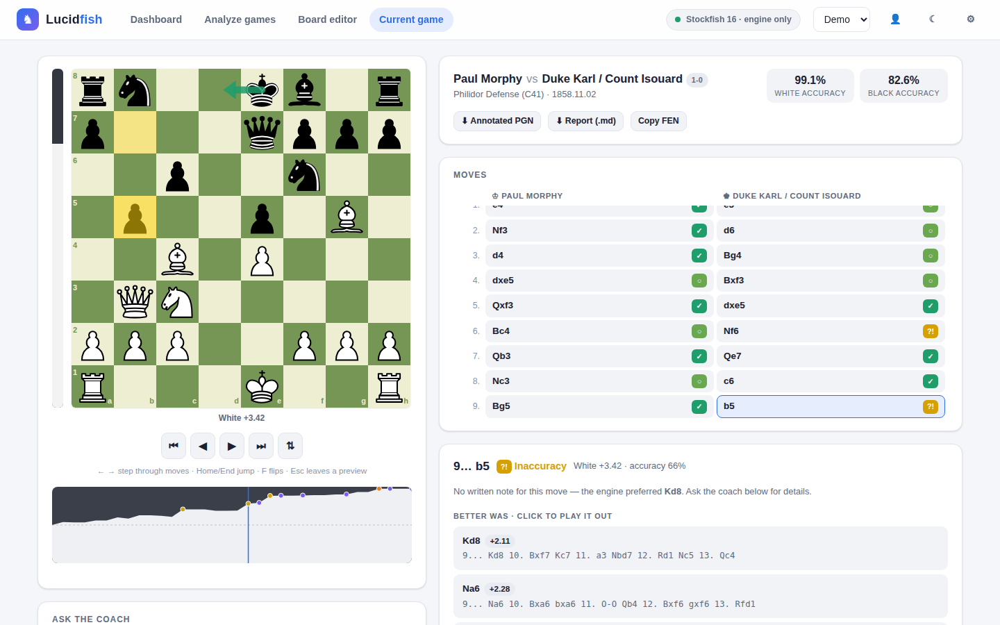

# Lucidfish

[](https://github.com/s4mstruthers/Lucidfish/actions/workflows/ci.yml)

**Stockfish tells you the best move — Lucidfish tells you _why_.**

Lucidfish reviews your chess games like a coach and a commentator. The Stockfish engine
finds what happened; an AI language model (running on your own computer, or a cloud model
if you prefer) explains it in plain chess concepts. It follows the flow of the game: what
each player was trying to do, which plans and pawn breaks they were working towards, and
why a move was played ("Black keeps pushing on the queenside to open the a-file"). So when
you look back on a game, you can see the intention behind every move, not just its verdict.
The feedback is pitched at your level and linked to the mistakes you keep making across games.


<sub>Game view, shown here in engine-only mode. With an AI coach enabled, each move also gets a written explanation.</sub>

---

## Contents

- [Features](#features)
- [How it works](#how-it-works)
- [Before you start: hardware and performance](#before-you-start-hardware-and-performance)
- [Installation](#installation) — [macOS](#macos) · [Windows](#windows) · [Linux](#linux)
- [Choosing an AI coach](#choosing-an-ai-coach)
- [Using API keys safely](#using-api-keys-safely)
- [Using the web app](#using-the-web-app)
- [Sharing a profile](#sharing-a-profile)
- [Command line](#command-line)
- [Configuration](#configuration)
- [How accurate is the feedback?](#how-accurate-is-the-feedback)
- [Troubleshooting](#troubleshooting)
- [Privacy and your data](#privacy-and-your-data)
- [Development](#development)
- [Acknowledgements and licences](#acknowledgements-and-licences)

---

## Features

- **Commentary on the flow of the game.** Every move by both players gets a commentator's
  line about its purpose: the plan it belongs to, the wing it works on, the break it prepares,
  and how it answers the opponent. Read the whole game as a story in the *Story* tab, split
  into chapters ("Black's queenside pawn storm", "The decisive attack") with a short summary
  of each.
- **Explained, not just evaluated.** Every mistake gets a written explanation of *why* it
  was a mistake, what the better move achieves, and the line that punishes it.
- **Grounded in verified facts.** The AI never analyses the position itself. It receives
  engine lines plus facts checked directly on the board (hanging pieces, forks, pins,
  skewers, mate threats, king safety, pawn structure), and its notes are fact-checked
  against the position afterwards. Specialist checks add the lessons coaches care about
  most: **missed threats** (the opponent was already threatening the move that punished
  you), **endgame technique** (active kings, passed pawns, whether a king can catch a pawn,
  the opposition) and **the move where you left opening theory**, with what masters play
  there instead.
- **Accuracy you can compare.** Moves are judged by lost *winning chances*, and game
  accuracy uses Lichess's published formula, so the numbers line up with what you see there.
- **Personal coaching.** Profiles remember your games, ratings and level. After a couple of
  analyses, the coach writes a progress review of your recurring weaknesses and refers
  back to them in later games. The home page shows your accuracy in the opening,
  middlegame and endgame, the kinds of mistakes you make most (hanging material,
  missed threats, errors in time trouble, …) and **patterns across your games**: whether
  you convert winning positions, how you score when you castle late, with White and with
  Black, in each time control, and how your games go after they leave opening theory.
- **Practise your mistakes.** Jump back to any position where you went wrong, play a better
  move on the board, and the engine tells you straight away whether it works and, if not,
  shows the line that refutes it. The answer to your own mistakes stays hidden until you
  have tried (or choose to see it), so you actually get to think.
- **Train on your own mistakes.** The *Train* page turns the positions where you went wrong,
  across all your games, into puzzles, ranked by importance (★★★ the error changed the game,
  ★★ a clear mistake, ★ minor) and grouped by theme (missed threats, hanging
  material, missed tactics, mates, king safety, game phase). Solve one and it comes back less
  and less often (after 1, 3, 7, 16 and 35 days); miss it and it returns at the end of the
  session and again the next day. This is spaced repetition, the way flashcard apps make
  things stick. By default it's kept manageable: key and costly errors only, no bullet games or
  moves made in time trouble, and at most 10 new puzzles a day.
- **Everything per time control.** Pick *Bullet*, *Blitz*, *Rapid*, … at the top of Home,
  Games, Train or *Analyse new games*, and every page follows: the statistics, patterns and
  openings, the games list, the puzzles, and the recent games fetched from chess.com or
  Lichess (so "analyse my last 5 rapid games" is two clicks). Each time control gets its own
  coach review, and the overall review compares them. Time controls follow each site's own
  rules: a 30-minute game is rapid on chess.com and classical on Lichess.
- **Explore any position.** Press 🔍 *Explore* (<kbd>E</kbd>) and move the pieces yourself:
  Stockfish runs inside the browser and shows the evaluation and its three best lines as you
  go. Take moves back and forth with the arrow keys.
- **Share a profile with someone who doesn't run Lucidfish.** Save a profile as a single web
  page (or keep one up to date in a shared iCloud Drive, Google Drive or Dropbox folder). It
  opens in any browser with nothing to install and no API key, and it stays interactive:
  practise, train, explore with the built-in engine, and draw. See
  [Sharing a profile](#sharing-a-profile).
- **Draw on the board.** Right-click to circle a square, right-drag to draw an arrow (Shift
  for red, Alt for blue), or use the ✎ pen on a tablet. Drawings are saved with the game
  and exported in the annotated PGN.
- **Local or cloud AI.** Run a model privately on your computer with
  [Ollama](https://ollama.com) or LM Studio, or plug in OpenAI, Anthropic (Claude),
  Google Gemini, OpenRouter or Groq with an API key. Or switch the AI off for fast,
  engine-only analysis.
- **Your games, one click away.** Pick recent games from chess.com or Lichess by username,
  paste or drop a PGN, or set up any position in the board editor.
- **All your analysed games in one place.** The *Games* page lists every game you've
  analysed, with result, accuracy and mistakes at a glance. Search by opponent or opening,
  filter by result, colour and time control, sort by date or accuracy, and re-analyse a game
  with new settings.
- **An analysis queue with live progress.** Queue one game or twenty. A progress bar shows
  how far each game and the whole batch are, how much time is left, and roughly when it
  will be done. Reorder, pause, resume or remove games at any time; the queue survives a
  restart. Time estimates learn how fast your computer is.
- **A modern web app.** Moves appear while the game is analysed, with an interactive board,
  arrows and an evaluation bar, a clickable evaluation graph, buttons that jump between
  the key moments, variation previews, coach chat, and light and dark themes. Engine hints
  (best-move arrow, evaluation bar and graph, move highlights) can each be switched off.
  Several people can share one computer, each with their own profile. It also works on
  phones and tablets.
- **Export.** Annotated PGN (verdict symbols, evaluations, notes and best lines, ready for a
  Lichess study or ChessBase) or a Markdown report.
- **Efficient without cutting corners.** Commentary is written for 8 moves per AI request,
  and the engine searches the next queued game while the AI is still writing. Engine
  results and opening lookups are cached, so re-analysing a game is nearly instant.
  See [Why it's fast](#why-its-fast).
- **Runs on macOS, Windows and Linux.**

## How it works

```
 PGN / chess.com / Lichess
            │
            ▼
 ┌────────────────────┐  candidate lines, evals,       ┌───────────────────┐
 │ Stockfish          │─ refutations, winning chances ─▶│                   │
 │ (engine.py)        │                                  │  Prompt builder   │
 ├────────────────────┤  hanging pieces, forks, pins,    │  (prompts.py)     │    ┌──────────────┐
 │ Board analysis     │─ mate threats, king safety,    ─▶│  only verified    │───▶│  AI coach    │──▶ explanation
 │ (tactics.py,       │  pawn structure, development     │  evidence goes in │    │  (llm.py)    │   (fact-checked
 │  features.py)      │                                  │                   │    └──────────────┘    against the board)
 ├────────────────────┤  opening name + what masters     │                   │
 │ Opening explorer   │─ play in this position          ─▶│                   │
 │ (opening.py)       │                                  └───────────────────┘
 └────────────────────┘
```

The engine and the AI run at the same time: while the coach writes about move 10, Stockfish
is already analysing move 14. Results appear in the web app as soon as each move is ready.

### Following the flow of the game

A move only makes sense in context: *why* did White play a4? To explain intentions without
the AI having to "read" the board (which language models do badly), Lucidfish gives it
verified context for every stretch of moves:

- **A plan tracker** (`plans.py`) summarises, from the moves actually played, where each side
  has been active (queenside, centre, kingside), which pawns have advanced on which wing,
  which pawn breaks are available, which files are open and whose rooks are on them, and
  whether the kings are on opposite wings.
- **The recent moves and what happened next.** Because the whole game is known, the coach
  can say "this prepares …a5, which Black played three moves later". Every move shown to
  the AI carries its side ("13… Black a5"), so it cannot give one side's move to the other.
- **Every claim is fact-checked.** A move mentioned in a note must be playable by the side
  the sentence attributes it to, a piece must stand where the note says, and a capture must
  have happened the way it is described. Sentences that fail are corrected or removed.
- **Chapters.** Once the moves are done, the game is split where the phase changes and at
  its turning points (big swings in winning chances). The coach summarises each chapter
  from its commentary, and the post-game review is written from the chapter summaries:
  a short, structured input instead of the whole game at once.

The layers build on each other, like a team of specialists reporting to a head coach:
code checks the board (engine, tactics, threats, endgame, opening theory, plans), the
commentary combines those facts eight moves at a time, the chapters combine the commentary,
the review combines the chapters, and your coach profile combines your reviews and the
patterns found across your games. Only the combining is done by the AI; everything it
combines has been verified.

### Why it's fast

Writing one AI request per move would be slow, especially with a local model, and would lose
the thread between moves. Instead, the default **Commentary** level uses three ideas:

1. **Commentary windows.** One request covers 8 consecutive moves (4 by each side), so the AI
   sees them as one stretch of play and writes connected commentary. That is about 8 times
   fewer requests than one per move. Mistakes and critical moments still get their own full,
   detailed note.
2. **Cheap context instead of long history.** The plan tracker compresses the game so far
   into a few verified lines, so prompts stay short however long the game is.
3. **No idle hardware.** Stockfish (CPU) and the AI (GPU or network) run at the same time.
   In the queue, once the engine has finished a game, it immediately starts on the next one
   while the AI finishes writing, so the engine work for the next game is usually done
   before it starts. Accuracy is unchanged: the same depth and settings are used.

| Coaching detail | What you get | AI requests for a 40-move game |
|---|---|---|
| **Key moments** | Notes for your mistakes and the critical moments only | ~5–10 |
| **Commentary** (default) | A line on every move by both players, plus full notes for your mistakes and critical moments | ~15–20 |
| **Every move** | A full note on every move by both players | ~80 |

## Before you start: hardware and performance

Lucidfish needs two programs besides itself: **Stockfish** (the engine) and, optionally,
an **AI model** for the written explanations.

> **Running an AI model locally is processor-intensive.** Local models use a lot of memory
> and compute. They run best on a Mac with Apple Silicon or a PC with a recent graphics card.
> On a laptop without a GPU, expect each explanation to take several seconds, and your
> fans to spin up. Stockfish is also CPU-heavy while it analyses.
> If your computer struggles, choose a smaller model, set the coaching detail to
> **Key moments**, use a cloud provider, or turn the AI coach off.

| Your computer | Suggested local model (Ollama) | Download size | Notes |
|---|---|---|---|
| 8 GB RAM | `llama3.2:3b` | ~2 GB | Shorter, simpler explanations |
| 16 GB RAM | `llama3.1:8b` (default) or `qwen2.5:7b` | ~5 GB | Good balance |
| 32 GB RAM or more | `qwen2.5:14b` or `gemma3:12b` | 8–9 GB | Better prose, slower |

Approximate speed for a 40-move game at the default settings: the engine takes 1–3 minutes
on a modern laptop. The AI's time depends on your hardware and model; a cloud model is
usually fastest.

## Installation

You need **Python 3.10 or newer** ([python.org/downloads](https://www.python.org/downloads/)),
**Stockfish**, and optionally **Ollama** for a local AI.

The quickest way to start is the launcher script. It creates a private Python environment
in `.venv` the first time, installs everything, and opens the app in your browser:

| System | Start Lucidfish |
|---|---|
| macOS / Linux | `./scripts/start.sh` |
| Windows | double-click `scripts\start.bat` |

Prefer to do it by hand? `pip install -e .` inside a virtual environment, then run
`lucidfish web` (details for each system below).

### macOS

```bash
# 1. Engine
brew install stockfish

# 2. Local AI (optional — skip if you'll use a cloud provider or engine-only mode)
brew install ollama          # or download the app from https://ollama.com/download
ollama serve                 # leave running (the Ollama app does this for you)
ollama pull llama3.1:8b      # ~5 GB, one-off download

# 3. Lucidfish
git clone https://github.com/s4mstruthers/Lucidfish.git
cd Lucidfish
./scripts/start.sh
```

### Windows

1. **Python:** install it from [python.org](https://www.python.org/downloads/windows/) and tick
   **"Add python.exe to PATH"** during setup.
2. **Stockfish:** download the Windows build from
   [stockfishchess.org/download](https://stockfishchess.org/download/) and unzip it (for example
   to `C:\Stockfish`). Lucidfish looks in common places — `C:\`, your home, Downloads and Desktop
   folders, Program Files, and the Chocolatey, Scoop and winget folders. If it can't find it, set the path in
   **Settings → Analysis → Stockfish**.
3. **Local AI (optional):** install [Ollama for Windows](https://ollama.com/download), then in a
   terminal run `ollama pull llama3.1:8b`.
4. **Lucidfish:** download this repository (Code → Download ZIP, or `git clone`), open the folder
   and double-click `scripts\start.bat`.

Manual install in PowerShell:

```powershell
py -3 -m venv .venv
.venv\Scripts\python.exe -m pip install -e .
.venv\Scripts\lucidfish.exe web
```

### Linux

```bash
# 1. Engine (Debian/Ubuntu shown; Fedora: sudo dnf install stockfish; Arch: sudo pacman -S stockfish)
sudo apt install stockfish python3-venv

# 2. Local AI (optional)
curl -fsSL https://ollama.com/install.sh | sh
ollama pull llama3.1:8b

# 3. Lucidfish
git clone https://github.com/s4mstruthers/Lucidfish.git
cd Lucidfish
./scripts/start.sh
```

On Debian and Ubuntu, Stockfish installs to `/usr/games/stockfish`, which Lucidfish finds
automatically even if it isn't on your `PATH`.

**Check your setup** at any time with `lucidfish --check` (it tests the engine and the AI
coach), or look at the status pill in the top-right corner of the web app.

## Choosing an AI coach

Open **Settings (⚙) → AI coach** and pick where the coach runs. Use **Test connection** to
make sure it works before analysing.

| Provider | Runs | Needs | Default model | Good to know |
|---|---|---|---|---|
| **Ollama** | on your computer | [Ollama](https://ollama.com) + a pulled model | `llama3.1:8b` | Private and free; uses your CPU/GPU |
| **Custom OpenAI-compatible** | on your computer (or any server) | a server URL, e.g. LM Studio `http://localhost:1234/v1` | — | Also works with llama.cpp, vLLM, LocalAI |
| **OpenAI** | cloud | `OPENAI_API_KEY` | `gpt-4.1-mini` | |
| **Anthropic (Claude)** | cloud | `ANTHROPIC_API_KEY` | `claude-opus-5` | `claude-sonnet-5` and `claude-haiku-4-5` are cheaper options |
| **Google Gemini** | cloud | `GEMINI_API_KEY` | `gemini-2.5-flash` | |
| **OpenRouter** | cloud | `OPENROUTER_API_KEY` | `openai/gpt-4.1-mini` | One key, hundreds of models |
| **Groq** | cloud | `GROQ_API_KEY` | `llama-3.3-70b-versatile` | Very fast open-weight models |

You can type any model name the provider offers; the list only shows suggestions. Model
catalogues change often, so if a default stops working, choose a current model.

**Cost:** cloud providers charge per use. A 40-move game at the *Commentary* detail level makes
roughly 15–20 requests. Use *Key moments* or a smaller model to spend less, or use a cloud
model only as the second model (below). Check your provider's pricing page.

**Coaching detail** (Settings → Analysis) controls how much the coach writes, and therefore
how long an analysis takes:

| Level | What gets written | Speed |
|---|---|---|
| **Key moments** | Notes on your mistakes and the game's critical moments | Fastest |
| **Commentary** (default) | A commentator's line on every move by both players, plus full notes on your mistakes and critical moments | Balanced |
| **Every move** | A detailed note on every move by both players | Slowest |

### Which local model? (Ollama)

Pick by how much memory your computer has. Good starting points:

| Memory | Model | Why |
|---|---|---|
| 8 GB | `llama3.2:3b` | Small enough to leave room for everything else |
| 16 GB | `qwen2.5:7b` or `qwen3:8b` | Follow Lucidfish's strict format well; about 5 GB |
| 24 GB or more | `qwen2.5:14b`, `qwen3:14b` or `gemma3:12b` | Noticeably better explanations, about half the speed |

*Thinking* models such as `qwen3` normally write hidden reasoning before answering, which is
slow and eats into the answer's length limit. Lucidfish switches that off for Ollama, so they
answer directly. (If a model can't switch it off, Lucidfish notices and asks it normally.)

### Two models: a fast one for commentary, a smarter one for the hard parts

Under **Settings → AI coach → Second model for the hard parts** you can add a second model:

- The **main model** writes the move-by-move commentary. It handles most of the requests, so
  a fast local model is ideal.
- The **second model** writes the detailed notes on your mistakes and critical moments, the
  post-game review, your coach profile, chat answers and board-editor assessments. These are
  the jobs where a smarter model makes the biggest difference, and there are only a handful
  per game.
- **Escalation:** if a stretch of commentary fails the fact-check, the second model rewrites
  it, instead of the main model trying again.
- If the second model stops working (e.g. no internet or an expired key), the main model
  takes over its jobs and the game page shows a warning.

A good setup for a laptop is a local main model (e.g. `qwen2.5:7b`) with a small cloud model
(e.g. `claude-haiku-4-5`, `gpt-4.1-mini` or `gemini-2.5-flash`) as the second model. The
cloud model only sees the evidence for your key moments and the review, so the cost stays
small. It also works in parallel with your computer, so games finish sooner. From the
command line: `--expert-provider anthropic --expert-model claude-haiku-4-5`, or set
`LUCIDFISH_EXPERT_PROVIDER` / `LUCIDFISH_EXPERT_MODEL`.

## Using API keys safely

Cloud providers need an API key. A key works like a password that can spend money, so
Lucidfish treats it that way. There are three ways to provide one, from most to least convenient:

1. **The Settings panel (recommended).** Paste the key and click *Save key*. It is stored in
   your operating system's credential store: **macOS Keychain**, **Windows Credential
   Manager**, or **Secret Service / KWallet** on Linux. If your system has no secure store
   (for example a headless Linux server), the key is kept in memory only until Lucidfish
   stops, and the app tells you so.
2. **An environment variable**, e.g. `export ANTHROPIC_API_KEY=...` (macOS/Linux) or
   `setx ANTHROPIC_API_KEY "..."` (Windows, then open a new terminal).
3. **A `.env` file.** Copy [`.env.example`](.env.example) to `.env` in the Lucidfish folder
   (or your data folder) and fill in the keys you use. `.env` is in `.gitignore`, so it is
   never committed.

What Lucidfish guarantees:

- Keys are **never written to its database**, never logged, and **never sent back to the
  browser**. The Settings panel only shows a masked hint such as `sk-…a1b2` and where the
  key came from.
- If a provider's error message echoes your key, Lucidfish removes it before showing the error.
- Keys are only sent to the provider you chose (cloud providers are always reached over HTTPS).
- The web server listens on `127.0.0.1` (this computer only). It rejects requests from other
  websites (cross-site request forgery protection) and from unexpected host names
  (DNS-rebinding protection), and it sets a strict Content Security Policy.

To remove a key, click *Remove* in Settings, or delete the "lucidfish" entry in your system's
keychain app.

## Using the web app

Start it with `./scripts/start.sh`, `scripts\start.bat`, or `lucidfish web`. It opens
`http://127.0.0.1:8420`; if that port is busy, it uses the next free one and prints the address.

The app has four sections: **Home** (your progress), **Games** (your analysed games and new
ones to analyse), **Train** (puzzles from your mistakes) and **Board editor**. Your profile is in the top-right corner; ⚙ **Settings**
is next to it.

1. **Create a profile** (first launch): your name, level, and chess.com / Lichess usernames.
   Each game is coached at *your rating in that game* (chess.com and Lichess put it in every
   game file), and the coach is told which site it's from, since Lichess ratings run a few
   hundred points higher. The profile keeps your newest rating per site and time control by
   itself, from the games you analyse; *Look up* fetches your current ones. Those are used for
   games without a rating (e.g. over the board) and the board editor. To add another person or
   switch between profiles, click your name in the top-right corner.
2. **Analyse games** (Games → *Analyse new games*): choose chess.com or Lichess to list your
   recent games, and a time control to list only those (for chess.com, Lucidfish looks back up
   to a year to find them). Click games to select them (<kbd>Shift</kbd>-click selects a range,
   or use *Select all*), then *Analyze selected*, or *Analyze batch* for your last 5–20 games. The
   *Analyze* button on a row analyses just that game, and *Open* shows one you've already
   analysed. You can choose a lighter or heavier coaching level for a batch, or paste or drop
   a PGN file instead.
3. **Watch the queue:** the pill at the top shows the current game and the time left. Click it
   to open the queue: an overall progress bar with the estimated finish time, a bar for the
   game in progress, and each waiting game with when it will start. Move games up or down,
   remove them, or pause the whole queue. A game you open yourself jumps to the front.
   If you close Lucidfish with games still waiting, they come back paused next time.
4. **Review the game:** moves appear while the analysis runs. Click any move, or use
   <kbd>←</kbd>/<kbd>→</kbd> (<kbd>Home</kbd>/<kbd>End</kbd> to jump, <kbd>F</kbd> to flip).
   <kbd>N</kbd> and <kbd>P</kbd> (or the ⚑ buttons) jump to the next or previous key moment.
   Each move shows the commentary, its verdict, tactical tags, verified facts (a missed
   threat, the move that left opening theory), the coach's note, better alternatives, and
   the line that punishes a mistake. Click a line to play it out on the board, and press
   <kbd>Esc</kbd> to return. Switch the move list to **Story** to read the whole game as a
   commentary, chapter by chapter. *← Games* (or the browser's Back button) takes you back.
5. **Practise your mistakes:** on your own mistakes the answer is hidden at first. Click
   *Find a better move* and drag a piece on the board: the engine judges your move with the
   same standards as the analysis. *Show the answer* reveals the note and the better move.
   *Practise my mistakes* in the game header steps through all of them. (To always see the
   answers straight away, switch this off in Settings → Analysis.)
6. **Draw and choose what the board shows:** right-click a square to circle it, right-drag
   for an arrow (<kbd>Shift</kbd> red, <kbd>Alt</kbd> blue, both yellow), or press
   *✎ Draw* (<kbd>D</kbd>) to draw with a normal click or a finger. A plain click on the
   board clears the drawing. *👁 Board* switches the best-move arrow (<kbd>A</kbd>), the
   last-move highlight, the evaluation bar and the graph on or off.
7. **Games:** every analysed game is saved to your profile. Search and filter them by time
   control, result, colour or text (e.g. all your losses as Black in blitz, or every
   Sicilian), see your record and average accuracy
   for that selection, and click a game to review it. Each game has its own address, so a
   reload keeps you on it. *↻ Re-analyse* runs a game again with your current settings.
8. **Ask the coach** about the position you're looking at, or about your overall progress on
   the Home page.
9. **Export** an annotated PGN (with the commentary, chapters and your drawings) or a
   Markdown report from the game header.
10. **Board editor:** set up any position (or paste a FEN) and ask for an assessment from
    either side's point of view.
11. **Explore:** press *🔍 Explore* under the board (or <kbd>E</kbd>) to leave the game and move
    the pieces yourself. The engine (Stockfish, running in your browser) shows the evaluation,
    an arrow for its best move and its three best lines; click a line to play its first move.
    <kbd>←</kbd>/<kbd>→</kbd> take moves back and replay them, *⟲ Reset* returns to where you
    started, and <kbd>Esc</kbd> or *✕ Done* goes back to the game. During practice, Explore
    unlocks once you've tried the position.
12. **Train:** the *Train* page shows how many puzzles are to do today, not started, being
    learned and mastered. Choose a time control, a theme (e.g. *Missed threats*), how important
    the puzzles must be (★★★ key only, ★★ key and costly, or everything), how many new ones a
    day, and whether to include bullet games or moves made in time trouble. *Start training*
    gives you a session of 5, 10 or 20: first the ones due for review, then new ones, the most
    important first. Each puzzle opens in its game, so after solving it you can read the coach's
    note, play out the lines, or explore. Solve a puzzle on the first try and it moves up a
    level; miss it (or ask for the answer) and it starts again. Progress is saved in your browser.

The **Home** page shows your record, average accuracy, patterns across your games, your
accuracy in each phase of the game (with your weakest phase highlighted), your most common
mistake types, your openings and how you score in them, and the coach's written review of
your progress. Choose a time control at the top to see all of it for, say, your rapid games
only, with the coach's review of those games; each game is also coached with the review for
its time control in mind. The review updates by itself after new analyses (Settings → AI coach →
*Update my coach review automatically*, on by default): it's rewritten once the analysis queue
has finished, so it never slows an analysis down, and the Home page shows when it was last
updated, or that an update is on its way. *⟳ Update review* rewrites it on demand.

## Sharing a profile

Lucidfish needs a reasonably fast computer for the analysis, but the *results* can go
anywhere. Someone without Lucidfish (a partner, a student, a friend on a Chromebook) can get
a profile as **one web page**:

- Click your name in the top-right corner → **Share this profile**.
- **Download the page** and send it by email, AirDrop or a chat app. Or
- **keep it up to date in a shared folder**: pick a folder that syncs to their computer (a
  shared iCloud Drive, Google Drive, Dropbox or OneDrive folder; Lucidfish suggests the ones it
  finds). The page is rewritten after every analysis of that profile, so they always open the
  latest version. The file is replaced in one step, so a sync app never picks up half a file.

The page is the normal app with the profile's games built in. It opens from disk in any modern
browser (Chrome, Edge, Firefox, Safari) on a laptop or desktop, works offline, needs no AI or
API key, and never contacts a server. They can:

- browse the games, the commentary, the chapters and the review, and see the Home page's
  statistics and patterns;
- **practise their mistakes** and **train** with spaced repetition. Progress is saved in their
  browser and carries over when a newer copy replaces the file, as the shared folder does.
  *💾 Save my progress* on the Train page downloads it as a small file (a backup, or to carry
  it to another computer or browser) and *📂 Load progress* merges it back in; for each puzzle
  the most recently practised version wins, so an old backup never undoes newer practice;
- **explore** any position with the built-in engine;
- draw on the board (also saved in their browser).

The built-in engine is Stockfish compiled to WebAssembly, and it makes the page about 10 MB.
Untick *Include the chess engine* (or use `lucidfish share --no-engine`) for a page under
1 MB. Without the engine, practice moves are judged only against the engine's top moves
stored with each game, and Explore can move the pieces but shows no evaluation.

Things that need Lucidfish itself are hidden in the shared page: analysing new games, the AI
coach chat and the board editor.

On a phone the page opens in the browser too, but some phones preview downloaded HTML files
without running them (the iPhone's Files and Mail previews, for example): use *Open in
Safari/Chrome*, or open it on a laptop.

## Command line

Everything the web app does can also be done in a terminal:

```bash
lucidfish examples/sample.pgn                      # analyse a PGN file
lucidfish --chesscom YOUR_NAME                     # your latest chess.com game
lucidfish --lichess YOUR_NAME --recent 2           # your second-latest Lichess game
lucidfish game.pgn --side white --elo 1400         # coach White, pitched at ~1400
lucidfish game.pgn --no-llm                        # engine-only, fast
lucidfish game.pgn --detail key                    # notes only for mistakes and key moments
lucidfish game.pgn --detail standard               # commentary on every move (default)
lucidfish game.pgn --provider anthropic --model claude-sonnet-5
lucidfish game.pgn --pgn-out annotated.pgn --out report.md --json analysis.json
lucidfish --check                                  # diagnose Stockfish and the AI coach
lucidfish web                                      # start the web app
lucidfish share --profile Ann --out ~/Dropbox      # save a profile as one web page (see above)
```

(Without installing the package, use `python -m lucidfish` instead of `lucidfish`.)

| Option | Meaning |
|---|---|
| `--chesscom USER`, `--lichess USER`, `--recent N` | Fetch a recent game instead of reading a file |
| `--side white\|black` | Coach this side (detected automatically for fetched games) |
| `--elo N` | Your rating, to pitch explanations at your level (default: your rating in the game, else your profile's) |
| `--detail key\|standard\|full`, `--explain-all` | How much the coach writes: key moments, commentary on every move, or a full note on every move (`--explain-all` = `full`) |
| `--provider`, `--model` | AI provider and model (defaults to what you saved in the web app) |
| `--expert-provider`, `--expert-model` | Second model for notes on mistakes, the review and fact-check rewrites (`none` = off) |
| `--no-llm` | Engine analysis only |
| `--preset fast\|balanced\|deep`, `--depth N`, `--fast` | Engine strength (depth 14 / 18 / 22, or 0.3 s per position) |
| `--threads N`, `--no-cache` | CPU threads for Stockfish; ignore stored engine results |
| `--out FILE.md`, `--pgn-out FILE.pgn`, `--json FILE.json` | Write a report, annotated PGN, or JSON |

## Configuration

Settings are applied in this order (later wins): built-in defaults → environment variables
and `.env` → settings saved in the web app → command-line flags.

| Variable | Default | Purpose |
|---|---|---|
| `LUCIDFISH_STOCKFISH` | auto-detected | Path to the Stockfish program |
| `LUCIDFISH_DEPTH` | `18` | Engine search depth per position |
| `LUCIDFISH_THREADS` | most of your cores, leaving some free (max 8) | Engine CPU threads |
| `LUCIDFISH_HASH_MB` | `256` | Engine hash table size |
| `LUCIDFISH_PROVIDER` | `ollama` | `ollama`, `openai`, `anthropic`, `gemini`, `openrouter`, `groq`, `custom` |
| `LUCIDFISH_MODEL` | provider default | Model name |
| `LUCIDFISH_BASE_URL` / `OLLAMA_HOST` | provider default | Server URL for local providers |
| `LUCIDFISH_EXPERT_PROVIDER`, `LUCIDFISH_EXPERT_MODEL` | — | Optional second model for the hard parts (see [Choosing an AI coach](#choosing-an-ai-coach)) |
| `LUCIDFISH_DETAIL` | `standard` | `key` (key moments), `standard` (commentary) or `full` (every move) |
| `LUCIDFISH_NUM_CTX` | `8192` | Context window for local models (prevents silent prompt truncation) |
| `LUCIDFISH_DATA_DIR` | per-user folder (see below) | Where the database is stored |
| `LUCIDFISH_PORT`, `LUCIDFISH_HOST` | `8420`, `127.0.0.1` | Web server address |
| `LUCIDFISH_ALLOWED_HOSTS` | — | Extra host names allowed when serving on a network (comma-separated) |
| `LUCIDFISH_CHESSCOM_USER`, `LUCIDFISH_LICHESS_USER` | — | Default account for `lucidfish` with no arguments |
| `LICHESS_TOKEN` | — | Only if the Lichess opening explorer requires authentication |
| `OPENAI_API_KEY`, `ANTHROPIC_API_KEY`, `GEMINI_API_KEY`, `OPENROUTER_API_KEY`, `GROQ_API_KEY`, `LUCIDFISH_CUSTOM_API_KEY` | — | API keys (see [Using API keys safely](#using-api-keys-safely)) |

## How accurate is the feedback?

Lucidfish is built so the explanation can only be as wrong as the evidence behind it, and
the evidence is checked in several ways:

- **Verdicts use winning chances, not raw centipawns** (the Lichess method). Going from +8 to
  +5 is still completely winning and is not called a blunder, while going from 0.0 to −2.0 is.
  A move is an *inaccuracy*, *mistake* or *blunder* when it costs at least 5, 10 or 15
  percentage points of winning chances.
- **Mates are handled explicitly.** Missing a forced mate, allowing one, and delivering one are
  each recognised and described correctly, using Lichess's rules.
- **Suspicious verdicts are double-checked.** Before a move is called a mistake or blunder,
  and when the engine's own top choice seems to collapse one move later, the position is
  searched deeper. This stops brilliant sacrifices being labelled blunders because of the
  engine's search horizon.
- **Tactics are verified on the board**, not guessed: static exchange evaluation for pieces
  that can be won, plus pins, skewers, forks and mate threats. The AI receives these as facts.
- **Notes are fact-checked, per side.** Each sentence is checked for the side it talks about
  ("White", "Black", "you", "your opponent", "…a5", "12. c4"). A move must be playable by
  that side in a position or line the coach was shown; a piece must stand on the square the
  note says; a capture must have happened the way it is described. The AI is asked once to
  correct any problem, and sentences that are still wrong are removed rather than shown.
  (For example, after White's a-pawn has captured on b4, "your opponent's next move may be
  a5" is rejected: White has no a-pawn left.)
- **The post-game review is checked too.** The coach is given verified facts about the game
  as a whole: the result from your side, how it ended (for example, lost on time with a forced
  mate on the board), which kinds of endgame it reached, if any, the clock, and verified
  highlights of what you did well. The written review is then checked against the game:
  - the result must be right ("mistakes that cost you the game" after a win is an error);
  - every move must be credited to the side that played it ("your Ne4" when White played it
    is an error), and a move called a mistake or blunder must have that verdict;
  - endgames the game never reached ("review king and pawn endings" with queens and rooks on
    the board) and time trouble the clocks don't show are errors too.

  Errors go back to the coach for one rewrite; anything still wrong is removed. Each key
  takeaway, and each point under *What went well*, must name a move or a verified fact, so
  stock advice and empty praise are dropped. Empty sections are written from the facts: the
  costliest mistakes and what was better, or the verified highlights.
- **Accuracy percentages** use the formula Lichess publishes, so they are directly comparable.

Limits: at low depth (the *Fast* preset), very deep combinations can still be misjudged, so use
*Balanced* or *Deep* for important games. Small local models occasionally phrase things
clumsily even when the facts are right; a larger model or a cloud model writes better prose.

## Troubleshooting

| Problem | Fix |
|---|---|
| "Stockfish isn't set up yet" | Install Stockfish (see [Installation](#installation)) or set its path in Settings → Analysis. On Windows, point it at the unzipped `stockfish*.exe`. |
| "Cannot reach Ollama" | Start the Ollama app (or run `ollama serve`). Check the server URL in Settings if Ollama runs on another port or machine. |
| "Model … is not installed in Ollama" | Run `ollama pull <model>`, or pick one of the installed models shown in Settings. |
| Analysis is slow | Use the *Key moments* detail level, a smaller model, a cloud provider, or the *Fast* engine preset. Close other heavy apps. |
| "rejected the API key" | Re-paste the key in Settings. Check it hasn't expired and that billing is enabled on your provider account. |
| Keys don't persist on Linux | Your desktop has no Secret Service running (common on servers). Use a `.env` file or an environment variable instead. |
| chess.com / Lichess games don't load | Check the username in your profile. Some networks block these sites; paste the PGN instead. |
| Opening names show without master statistics | The Lichess opening explorer couldn't be reached, so a built-in opening book is used. Analysis is unaffected. |
| Port 8420 already in use | Lucidfish picks the next free port automatically and prints the address. Or run `lucidfish web --port 9000`. |
| "Lucidfish needs a restart to finish updating" | The files were updated (e.g. with `git pull`) while Lucidfish was running, so the page is new but the running program is old. Close Lucidfish (<kbd>Ctrl</kbd>+<kbd>C</kbd> in its window) and start it again. |
| Queued games didn't start after a restart | Games left in the queue come back **paused**, so nothing starts by surprise. Open the queue and press *Resume*. |
| Time estimates look wrong | The first estimate is a rough guess. After one game with the same settings has finished, estimates use your computer's measured speed. |
| `ModuleNotFoundError` | Run from the Lucidfish folder with the virtual environment active, or use the launcher script. |

## Privacy and your data

Lucidfish is local-first. Your profiles, analysed games and caches are stored in one SQLite
file on your computer:

| System | Data folder |
|---|---|
| macOS | `~/Library/Application Support/Lucidfish` |
| Windows | `%APPDATA%\Lucidfish` |
| Linux | `~/.local/share/lucidfish` |

(Older versions stored it in `data/` inside the project folder; that location keeps working.)
Delete that folder to remove everything, or delete individual games and profiles in the app.

What leaves your computer: game lists are fetched from chess.com and Lichess by your browser;
opening statistics come from the Lichess opening explorer. With a cloud AI provider, the
evidence for each move (moves, engine lines and position facts) is sent to that provider.
With a local model, nothing about your games leaves your machine.

## Development

```bash
python -m venv .venv && source .venv/bin/activate     # Windows: .venv\Scripts\activate
pip install -e ".[dev]"
pytest                     # unit + integration tests (engine tests skip if Stockfish is missing)
ruff check lucidfish tests
```

The test suite never touches your real data or keychain: every test uses a temporary data
folder and the network is disabled. CI runs the suite on Linux, macOS and Windows.

| File | Role |
|---|---|
| `lucidfish/config.py` | Defaults, per-OS paths, Stockfish auto-detection, `.env` loading |
| `lucidfish/settings.py` | Merges defaults, environment and settings saved in the web app |
| `lucidfish/engine.py` | Stockfish wrapper, candidate lines, verdicts, evaluation cache hook |
| `lucidfish/scoring.py` | Winning chances, accuracy, evaluation wording |
| `lucidfish/tactics.py` | Static exchange evaluation, pins, skewers, forks, mate threats |
| `lucidfish/features.py` | Positional facts and "what changed" diffs |
| `lucidfish/endgame.py` | Endgame specialist: king activity, passed pawns, rule of the square, opposition |
| `lucidfish/opening.py` | Lichess opening explorer client and offline opening book |
| `lucidfish/prompts.py` | Prompt construction, output parsing, fact-checking |
| `lucidfish/llm.py` | AI providers (Ollama, OpenAI-compatible, Anthropic) |
| `lucidfish/credentials.py` | API key storage (environment, OS keychain, session) |
| `lucidfish/plans.py` | Plan tracker: wing activity, pawn advances, breaks, open files |
| `lucidfish/pipeline.py` | Orchestrates engine and coach; commentary windows; game review; position mode; practice moves |
| `lucidfish/jobs.py` | Analysis queue: ordering, live progress, learned time estimates, engine prefetch |
| `lucidfish/insights.py` | Accuracy by game phase, recurring mistake types, patterns across games |
| `lucidfish/store.py` | SQLite: profiles, games, settings, caches |
| `lucidfish/export.py` | Annotated PGN and Markdown reports |
| `lucidfish/fetch.py` | chess.com / Lichess game download (CLI) |
| `lucidfish/cli.py` | Command-line interface |
| `lucidfish/web.py` + `static/` | FastAPI backend and the browser app (plain JS, no build step) |

## Roadmap

- Real-time coaching from a connected board (e.g. ChessUp 2 over Bluetooth)
- "What would a human play?" suggestions (Maia)

## Acknowledgements and licences

- [Stockfish](https://stockfishchess.org) — the engine (GPL-3.0). The engine that analyses your
  games is installed separately. For Explore mode and shared pages, Lucidfish bundles
  [Stockfish.js](https://github.com/nmrugg/stockfish.js) 18 (the "lite, single-threaded"
  WebAssembly build, GPL-3.0; source code at that link) in `lucidfish/static/vendor/`, and a
  shared page carries a copy of it with its licence notice.
- [chess.js](https://github.com/jhlywa/chess.js) (BSD-2-Clause) — legal moves in the browser.
- [python-chess](https://github.com/niklasf/python-chess) (GPL-3.0+) — move generation, PGN,
  UCI, and the classic "Cburnett" piece images shown on the board.
- [chessboard.js](https://chessboardjs.com) and [jQuery](https://jquery.com) (both MIT) —
  bundled in `lucidfish/static/vendor/`; see `LICENSES.txt` there.
- [Lichess](https://lichess.org) — opening explorer and the accuracy/win-probability model.

Lucidfish itself has not chosen a licence yet.
